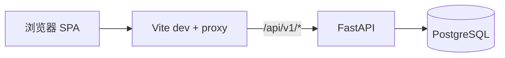
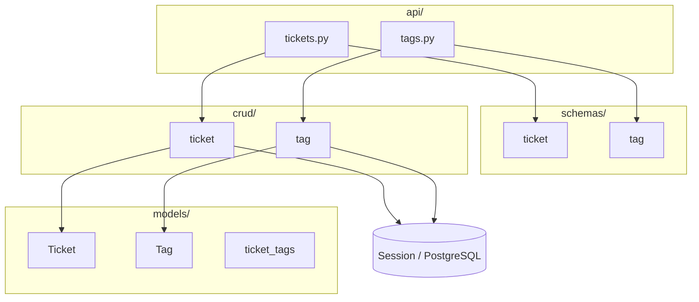
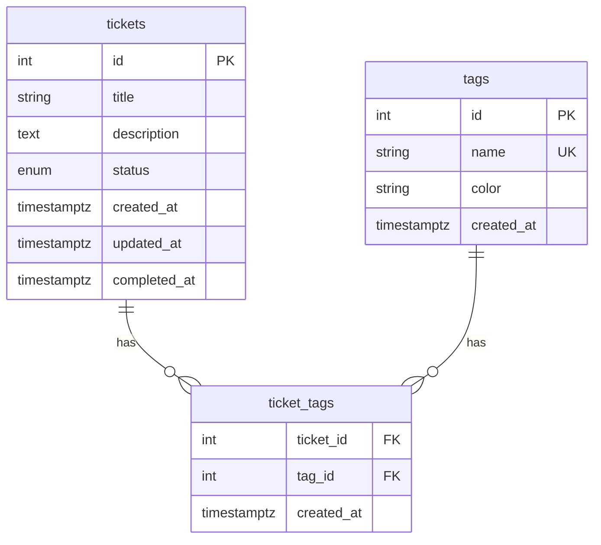
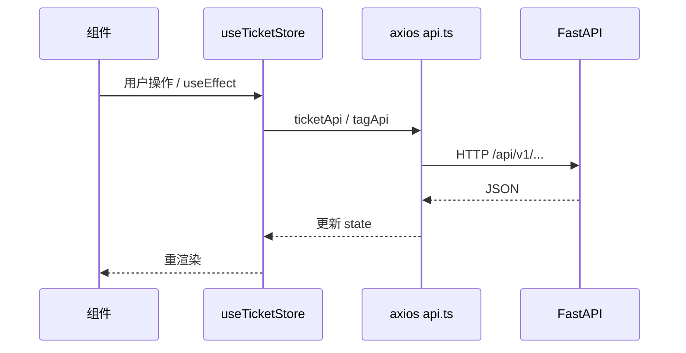

# EQ 管理平台架构说明

本文描述 EQ 管理平台（Ticket 管理系统，仓库名 `eq-management-platform`）的技术架构、分层与数据流，依据当前仓库源码整理。

---

## 1. 系统上下文

| 组件 | 技术 | 职责 |
|------|------|------|
| 浏览器 | React + Vite | 单页应用：列表、筛选、标签、表单与批量操作 |
| 后端 API | FastAPI | REST JSON，前缀 `/api/v1` |
| 数据库 | PostgreSQL | 持久化 tickets、tags 及多对多关联 |
| 迁移 | Alembic | 版本化 schema（见 `backend/alembic/versions/`） |

开发环境下，前端通过 Vite 将 `/api` 代理到 `http://localhost:8000`，请求路径与后端 `API_V1_PREFIX` 对齐。

---

## 2. 后端分层（`backend/app/`）

采用经典 **路由 → Schema → CRUD → Model** 结构：

| 目录/文件 | 说明 |
|-----------|------|
| `main.py` | 创建 `FastAPI` 应用，CORS、请求日志、`include_router(api_router)` |
| `config.py` | `pydantic-settings`：`.env` 中 `DATABASE_URL`、`ALLOWED_ORIGINS` 等 |
| `database.py` | `engine`、`SessionLocal`、`get_db()` 依赖注入 |
| `api/` | `APIRouter`：`/tickets`、`/tags` 子路由聚合在 `api/__init__.py` |
| `schemas/` | Pydantic 入参/出参模型 |
| `crud/` | SQLAlchemy 查询与事务操作 |
| `models/` | ORM：`Ticket`、`Tag`、关联表 `ticket_tags` |

**横切能力**

- CORS：允许前端源（默认 `http://localhost:5173`）。
- 每个 HTTP 请求记录方法、路径、状态码与耗时。

---

## 3. 数据模型

### 3.1 实体关系

- **Ticket**：标题、描述、状态（`PENDING` / `COMPLETED`）、时间戳、`completed_at`。
- **Tag**：名称（唯一）、颜色、创建时间。
- **ticket_tags**：多对多中间表，含 `ticket_id`、`tag_id`、`created_at`，外键级联删除。

### 3.2 迁移与种子

- Schema 变更通过 **Alembic** 管理（如初始表、触发器类迁移）。
- 演示数据可使用 **`backend/seed.sql`**（需先 `alembic upgrade head` 再导入）。

---

## 4. API 概览

基础路径：`{API_V1_PREFIX}`，默认 `/api/v1`。

| 分组 | 方法 | 路径模式 | 说明 |
|------|------|----------|------|
| Tickets | GET | `/tickets` | 列表：状态、标签 ID（逗号分隔）、搜索、分页 |
| Tickets | GET | `/tickets/{id}` | 单条 |
| Tickets | POST | `/tickets` | 创建 |
| Tickets | PUT | `/tickets/{id}` | 更新 |
| Tickets | DELETE | `/tickets/{id}` | 删除 |
| Tickets | PATCH | `/tickets/{id}/complete`、`/uncomplete` | 完成/取消完成 |
| Tickets | POST | `/tickets/{id}/tags` | 批量添加标签 |
| Tickets | DELETE | `/tickets/{id}/tags/{tag_id}` | 移除标签 |
| Tags | GET | `/tags`、`/tags/{id}` | 列表（含 ticket_count）/ 单条 |
| Tags | POST | `/tags` | 创建（重名返回 400） |
| Tags | DELETE | `/tags/{id}` | 删除 |

OpenAPI：`/api/v1/docs`、`/api/v1/redoc`。

---

## 5. 前端架构（`frontend/src/`）

### 5.1 技术栈

- React、TypeScript、Vite、Tailwind、Radix/shadcn 风格 UI、Zustand、TanStack Query（若项目中有使用以实际代码为准）、Axios（`lib/api.ts`）、Sonner 通知。

### 5.2 结构要点

| 区域 | 路径 | 职责 |
|------|------|------|
| 入口 | `main.tsx`、`App.tsx` | 布局：Header、侧栏筛选、Ticket 列表、表单与确认框；快捷键 |
| 状态 | `store/useTicketStore.ts` | 工单/标签 CRUD、筛选、排序、批量操作；调用 `lib/api.ts` |
| API | `lib/api.ts` | `baseURL: /api/v1`，经 Vite 代理到后端 |
| 类型 | `types/ticket.ts`、`types/tag.ts` | 与后端 Schema 对齐 |
| 组件 | `components/tickets/`、`tags/`、`layout/`、`common/` | 列表、卡片、表单、标签选择、筛选侧栏等 |

### 5.3 前端数据流（简化）

---

## 6. 配置与运行

| 项 | 位置 |
|----|------|
| 后端环境变量 | `backend/.env`（由 `.env.example` 复制） |
| 数据库 URL | `DATABASE_URL` |
| CORS | `ALLOWED_ORIGINS` |
| 前端开发代理 | `frontend/vite.config.ts` 中 `/api` → `http://localhost:8000` |

---

## 7. 与仓库 Skills 的关系说明

本仓库自带的 Agent Skills（例如 `pg-data`）用于在**已连接的 PostgreSQL** 上做自然语言只读查询等场景，**不替代**本文档所描述的 HTTP 与 ORM 架构。EQ 管理平台的业务数据仍以本项目的 **REST API + SQLAlchemy + Alembic** 为准。

---

## 8. 修订记录

| 日期 | 说明 |
|------|------|
| 2026-03-30 | 初版：基于当前仓库源码梳理 |
